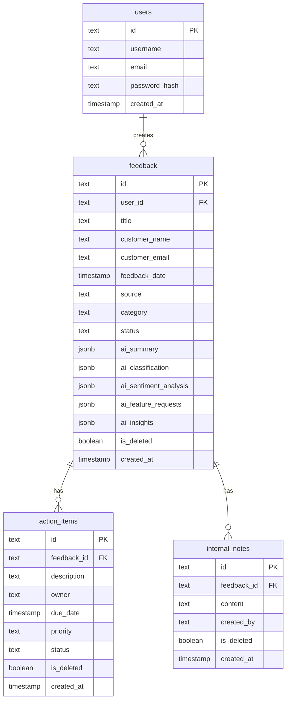

# AI Customer Feedback & Insights Tracker

An advanced full-stack AI-powered feedback analysis and action item tracking system. The application parses customer feedback records, runs AI models to auto-classify categories, sentiment, priority, and product areas, extracts key insights and feature requests, triggers actions, and provides a rich-text internal note-taking workspace for team members.

---

## 🛠️ Technology Stack

### Frontend
- **Framework**: Next.js 15 (App Router)
- **Styling**: Tailwind CSS & Vanilla CSS customization
- **UI Components**: Radix UI primitives & custom warm-burgundy dashboard theme
- **Form Handling**: React Hook Form & Zod validation
- **Rich Text Editor**: TinyMCE (v6.8.2) integrated via a self-hosted cdnjs CDN configuration (to bypass licensing restrictions)
- **HTTP Client**: Axios with interceptors

### Backend
- **Framework**: Node.js & Express (TypeScript)
- **Database ORM**: Drizzle ORM
- **Database**: PostgreSQL (hosted on Neon)
- **AI Integrations**: Vercel AI SDK (`ai` and `@ai-sdk/google` / `@ai-sdk/openai`)
- **Authentication**: Cookie-based JWT authentication

---

## 🚀 Setup Instructions

### Prerequisites
- Node.js (v18+)
- Neon PostgreSQL database instance

### Backend Installation & Start
1. Navigate to the backend directory:
   ```bash
   cd Backend
   ```
2. Install dependencies:
   ```bash
   npm install
   ```
3. Generate and run database migrations:
   ```bash
   npm run db:generate
   npm run db:migrate
   ```
4. Start the development server:
   ```bash
   npm run dev
   ```

### Frontend Installation & Start
1. Navigate to the frontend directory:
   ```bash
   cd Frontend
   ```
2. Install dependencies:
   ```bash
   npm install
   ```
3. Start the Next.js development server:
   ```bash
   npm run dev
   ```

---

## 🔑 Environment Variables

### Backend (`Backend/.env`)
Create a `.env` file inside the `Backend` directory containing the following:
```env
PORT=5000
DATABASE_URL=postgresql://<user>:<password>@<host>/<database>?sslmode=require
JWT_SECRET=your-secure-jwt-secret-key
GEMINI_API_KEY=your-gemini-api-key
OPENAI_API_KEY=your-openai-api-key
```

### Frontend (`Frontend/.env.local`)
Create a `.env.local` file inside the `Frontend` directory:
```env
NEXT_PUBLIC_API_URL=http://localhost:5000/api
```

---

## 🏗️ Architecture Overview

The codebase is organized as a monorepo consisting of two primary segments:
```
├── Backend/                 # Express REST API
│   ├── src/
│   │   ├── config/          # Configurations
│   │   ├── controllers/     # Route business logic (auth, feedback, action, note)
│   │   ├── db/              # Drizzle ORM schema, migrations, connection pool
│   │   ├── middleware/      # JWT authentication middleware
│   │   ├── routes/          # Express API routes definition
│   │   └── services/        # AI analytics logic
├── Frontend/                # Next.js Application
│   ├── src/
│   │   ├── app/             # App Router pages and tabs
│   │   ├── components/      # UI components & shared RichTextEditor
│   │   └── lib/             # Validation schemas, Axios helper instances
```

---

## 🗄️ Database Design



---

## 🔌 API Overview

### Authentication Routes (`/api/auth`)
- `POST /signup`: Registers a new user.
- `POST /login`: Logs in a user, setting a JWT HTTP-only cookie.
- `POST /logout`: Clears the authentication cookie.
- `GET /me`: Returns details of the currently authenticated user session.

### Feedback Routes (`/api/feedback`)
- `POST /`: Submits feedback, triggering background AI evaluation.
- `GET /`: Lists feedback records with support for `search`, `category`, `source`, `status`, and `limit` query parameters.
- `GET /:id`: Retrieves details of a specific feedback record.
- `PUT /:id`: Updates a feedback entry (and automatically regenerates AI classifications if the content changes).
- `DELETE /:id`: Soft-deletes a feedback record, cascading soft-delete states to associated action items and internal notes.

### Action Item Routes (`/api`)
- `GET /actions`: Retrieves all open action items across all user feedback entries.
- `GET /feedback/:feedbackId/actions`: Lists action items for a specific feedback entry.
- `POST /feedback/:feedbackId/actions`: Appends an action item to a feedback entry.
- `PUT /actions/:id`: Updates an action item's status, priority, description, or owner.
- `DELETE /actions/:id`: Soft-deletes an action item.

### Internal Notes Routes (`/api/feedback`)
- `GET /:feedbackId/notes`: Lists all active internal notes for a feedback record.
- `POST /:feedbackId/notes`: Adds an internal note (identifying the writer securely using user session context).
- `PUT /notes/:id`: Updates an internal note's content.
- `DELETE /notes/:id`: Soft-deletes an internal note.

---

## 🔒 Authentication Approach
- Authentication utilizes cookie-based JSON Web Tokens (JWT).
- The token is stored securely in the browser inside an HTTP-only, SameSite cookie, protecting the session from XSS attacks.
- Middleware (`authenticateToken`) decodes the token on the backend to authenticate API requests and provide context for ownership and audits.

---

## 🧠 AI Integration Approach
- Automatically runs a prompt using the Vercel AI SDK when feedback is submitted or edited.
- Classification leverages `gemini-3.5-flash-lite` to extract structured JSON containing:
  - **Category**: Classifies content (Bug, Feature Request, Usability, Performance, etc.).
  - **Sentiment Analysis**: Extracts the tone (Tone, Score, Positive/Neutral/Frustrated breakdown).
  - **Feature Requests**: Generates a list of suggested requests with priority, status, and rationales.
  - **Insights**: Extracts key actionable product suggestions.
  - **Summary**: Generates a high-level customer experience summary.

---

## 📝 Assumptions Made
1. **User Scope**: Users own their feedback records. A user can only see, query, modify, or delete feedback entries and action items that belong to them.
2. **Soft Deletions**: Deletions perform a soft-delete (`is_deleted = true`). Associated actions and internal notes cascade to a soft-deleted state when a parent feedback is removed.

---

## ✨ Features Completed
- [x] JWT cookie-based session signup, login, and authentication.
- [x] Automated AI feedback summarization, sentiment rating, category classification, and feature request generation.
- [x] AI Insights and Trends tab summarizing category distributions, priority breakdowns, requested features, and critical issues.
- [x] Responsive Kanban layout for tracking action items by status, along with desktop-to-mobile layout responsiveness.
- [x] Edit Action Item Dialog modals structured to optimize columns (3:2) for editing description, due date, owner, priority, and status.
- [x] Centralized shared `<RichTextEditor>` component leveraging TinyMCE loaded from `cdnjs` (bypassing online Tiny Cloud API key blocks).
- [x] Dedicated **Internal Notes** board for writing, editing, and soft-deleting rich-text annotations for customer feedback entries.
- [x] Separated **All Feedback** listing page with multi-dimensional filtering, while limiting the main dashboard list to the latest 5 entries.

---

## ⚠️ Known Limitations
- Rich text HTML inside table listings is truncated for legibility, showing raw text summaries rather than nested complex styling.
- Local execution depends on an online connection for the Neon PostgreSQL database and the Gemini API.

---

## 🔮 Future Improvements

### 1. Advanced AI & ML Enhancements
- **Multimodal Feedback Processing**: Allow users to attach bug screenshots, screen recordings, or product PDFs. Use vision models to extract visual descriptions and auto-detect UI/UX bugs.
- **Semantic Feedback Clustering (Embeddings)**: Generate embeddings for each feedback entry. Group similar feedback automatically to highlight the most statistically significant clusters of complaints or requests.
- **AI-Generated Reply Drafting**: Provide support agents with automated, tone-adjusted draft email responses tailored to the specific customer feedback and tone analysis.

### 2. Workflow & Integration Channels
- **Third-Party Customer Support Sync**: Build connectors (via webhooks or cron workers) to automatically ingest incoming tickets from platforms like Zendesk, Intercom, or HubSpot.
- **Developer Tool Sync (Jira / Linear)**: Create a two-way sync button on Action Items to push tasks straight to Jira or Linear issues.
- **Notification Triggers (Slack / MS Teams)**: Alert product teams in real-time when Critical priority or highly Frustrated customer feedback is detected.

### 3. Collaboration & Audit Enhancements
- **Role-Based Access Control (RBAC)**: Introduce user roles (e.g., `Admin`, `Product Manager`, `Support Agent`). Restrict internal note deletions and edit controls based on permissions.
- **Feedback Audit Logs**: Implement an audit trail to log actions (e.g., who changed a feedback's status, who edited a note, or when an action item was closed).
- **Mentioning & Comments**: Allow team members to tag others using `@username` in internal notes, triggering in-app or email notifications.

### 4. General Enhancements
- Add support for exporting dashboards and feedback summary cards to PDF or CSV format.
- Integrate real-time collaboration or websockets so multiple product managers can see live edits on action items and notes.
- Support file attachment uploads (PDFs, images) on internal notes for debugging or context.
